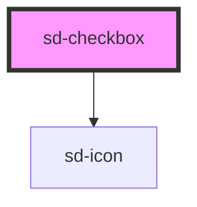

# sd-checkbox

<!-- Auto Generated Below -->

## Properties

| Property   | Attribute  | Description          | Type      | Default     |
| ---------- | ---------- | -------------------- | --------- | ----------- |
| `checked`  | `checked`  | 현재 선택 상태 또는 배열 형태의 값 | `any`     | `false`     |
| `disabled` | `disabled` | 비활성화 여부              | `boolean` | `false`     |
| `label`    | `label`    | 표시할 라벨 텍스트           | `string`  | `''`        |
| `val`      | `val`      | 배열 모드에서의 개별 값        | `any`     | `undefined` |

## Events

| Event    | Description | Type               |
| -------- | ----------- | ------------------ |
| `change` | 값 변경 이벤트    | `CustomEvent<any>` |

## Dependencies

### Depends on

- [sd-icon](../sd-icon)

### Graph

----------------------------------------------

*Built with [StencilJS](https://stenciljs.com/)*
