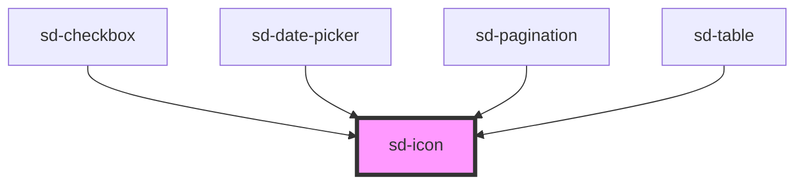

# sd-icon

<!-- Auto Generated Below -->

## Properties

| Property            | Attribute | Description             | Type                                                                                                                                                     | Default     |
| ------------------- | --------- | ----------------------- | -------------------------------------------------------------------------------------------------------------------------------------------------------- | ----------- |
| `color`             | `color`   | 아이콘 색상                  | `string \| undefined`                                                                                                                                    | `undefined` |
| `label`             | `label`   | 접근성을 위한 라벨              | `string \| undefined`                                                                                                                                    | `undefined` |
| `name` _(required)_ | `name`    | 아이콘명                    | `"arrowDown" \| "arrowLeft" \| "arrowLeftEnd" \| "arrowRight" \| "arrowRightEnd" \| "arrowUp" \| "check" \| "close" \| "date" \| "pageMove" \| "search"` | `undefined` |
| `rotate`            | `rotate`  | 회전 각도 (0, 90, 180, 270) | `0 \| 180 \| 270 \| 90 \| undefined`                                                                                                                     | `undefined` |
| `size`              | `size`    | 아이콘 크기                  | `number \| string`                                                                                                                                       | `12`        |

## Dependencies

### Used by

 - [sd-checkbox](../sd-checkbox)
 - [sd-date-picker](../sd-date-picker)
 - [sd-pagination](../sd-pagination)
 - [sd-table](../sd-table)

### Graph

----------------------------------------------

*Built with [StencilJS](https://stenciljs.com/)*
