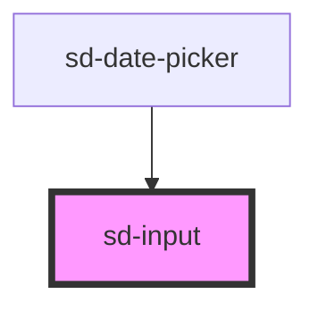

# sd-input

<!-- Auto Generated Below -->

## Properties

| Property      | Attribute     | Description | Type                                                                        | Default      |
| ------------- | ------------- | ----------- | --------------------------------------------------------------------------- | ------------ |
| `barcode`     | `barcode`     |             | `boolean \| undefined`                                                      | `false`      |
| `clearable`   | `clearable`   |             | `boolean`                                                                   | `false`      |
| `disabled`    | `disabled`    |             | `boolean`                                                                   | `false`      |
| `label`       | `label`       |             | `string \| undefined`                                                       | `undefined`  |
| `placeholder` | `placeholder` |             | `string`                                                                    | `'입력해 주세요.'` |
| `readonly`    | `readonly`    |             | `boolean`                                                                   | `false`      |
| `rules`       | --            |             | `(((value: string \| number \| null) => string \| boolean)[]) \| undefined` | `undefined`  |
| `value`       | `value`       |             | `null \| number \| string \| undefined`                                     | `null`       |
| `width`       | `width`       |             | `number \| undefined`                                                       | `undefined`  |

## Events

| Event      | Description | Type                                    |
| ---------- | ----------- | --------------------------------------- |
| `sdBlur`   |             | `CustomEvent<Event>`                    |
| `sdChange` |             | `CustomEvent<null \| number \| string>` |
| `sdClick`  |             | `CustomEvent<null \| number \| string>` |
| `sdFocus`  |             | `CustomEvent<Event>`                    |
| `sdInput`  |             | `CustomEvent<null \| number \| string>` |

## Dependencies

### Used by

 - [sd-date-picker](../sd-date-picker)

### Graph

----------------------------------------------

*Built with [StencilJS](https://stenciljs.com/)*
