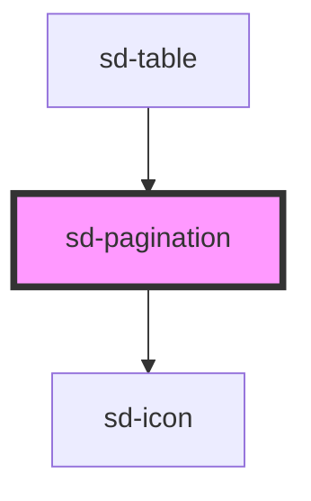

# sd-pagination

<!-- Auto Generated Below -->

## Properties

| Property      | Attribute      | Description | Type      | Default |
| ------------- | -------------- | ----------- | --------- | ------- |
| `currentPage` | `current-page` |             | `number`  | `1`     |
| `lastPage`    | `last-page`    |             | `number`  | `1`     |
| `simple`      | `simple`       |             | `boolean` | `false` |

## Events

| Event        | Description | Type                  |
| ------------ | ----------- | --------------------- |
| `pageChange` |             | `CustomEvent<number>` |

## Dependencies

### Used by

 - [sd-table](../sd-table)

### Depends on

- [sd-icon](../sd-icon)

### Graph

----------------------------------------------

*Built with [StencilJS](https://stenciljs.com/)*
