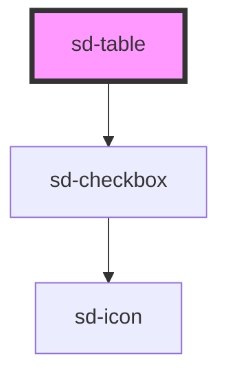

# sd-table

<!-- Auto Generated Below -->

## Properties

| Property       | Attribute       | Description    | Type                                                                                  | Default        |
| -------------- | --------------- | -------------- | ------------------------------------------------------------------------------------- | -------------- |
| `class`        | `class`         |                | `string`                                                                              | `''`           |
| `columns`      | --              | column 정의      | `SdTableColumn[]`                                                                     | `[]`           |
| `noDataLabel`  | `no-data-label` | 빈 상태 메시지       | `string`                                                                              | `'데이터가 없습니다.'` |
| `pagination`   | --              |                | `undefined \| { page: number; rowsPerPage: number; lastPage?: number \| undefined; }` | `undefined`    |
| `rowKey`       | `row-key`       | 행의 고유 식별자 프로퍼티 | `string`                                                                              | `'id'`         |
| `rows`         | --              | row 데이터        | `{ [key: string]: any; }[]`                                                           | `[]`           |
| `selectable`   | `selectable`    | 다중 선택 허용       | `boolean`                                                                             | `true`         |
| `selected`     | --              | 선택된 row 목록     | `Set<{ [key: string]: any; }>`                                                        | `new Set()`    |
| `stickyHeader` | `sticky-header` | 헤더 고정          | `boolean`                                                                             | `false`        |

## Dependencies

### Depends on

- [sd-checkbox](../sd-checkbox)

### Graph

----------------------------------------------

*Built with [StencilJS](https://stenciljs.com/)*
