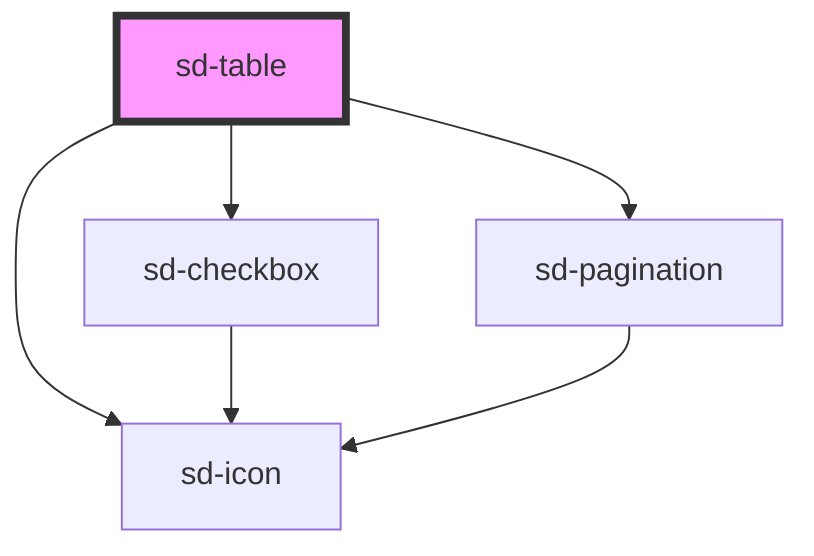

# sd-table

<!-- Auto Generated Below -->

## Properties

| Property           | Attribute       | Description | Type                                                                                             | Default        |
| ------------------ | --------------- | ----------- | ------------------------------------------------------------------------------------------------ | -------------- |
| `bodyCellRenderer` | --              |             | `((column: SdTableColumn, row: Row) => string \| HTMLElement \| null \| undefined) \| undefined` | `undefined`    |
| `columns`          | --              |             | `SdTableColumn[]`                                                                                | `[]`           |
| `noDataLabel`      | `no-data-label` |             | `string`                                                                                         | `'데이터가 없습니다.'` |
| `pagination`       | --              |             | `undefined \| { page: number; rowsPerPage: number; lastPage?: number \| undefined; }`            | `undefined`    |
| `resizable`        | `resizable`     |             | `boolean`                                                                                        | `false`        |
| `rowKey`           | `row-key`       |             | `string`                                                                                         | `'id'`         |
| `rows`             | --              |             | `Row[]`                                                                                          | `[]`           |
| `selectable`       | `selectable`    |             | `boolean`                                                                                        | `false`        |
| `selected`         | --              |             | `Set<Row>`                                                                                       | `new Set()`    |
| `stickyHeader`     | `sticky-header` |             | `boolean`                                                                                        | `false`        |

## Events

| Event            | Description | Type                  |
| ---------------- | ----------- | --------------------- |
| `sdPageChange`   |             | `CustomEvent<number>` |
| `sdSelectChange` |             | `CustomEvent<Row[]>`  |

## Shadow Parts

| Part            | Description |
| --------------- | ----------- |
| `"table"`       |             |
| `"tbody-empty"` |             |

## Dependencies

### Depends on

- [sd-checkbox](../sd-checkbox)
- [sd-icon](../sd-icon)
- [sd-pagination](../sd-pagination)

### Graph

----------------------------------------------

*Built with [StencilJS](https://stenciljs.com/)*
